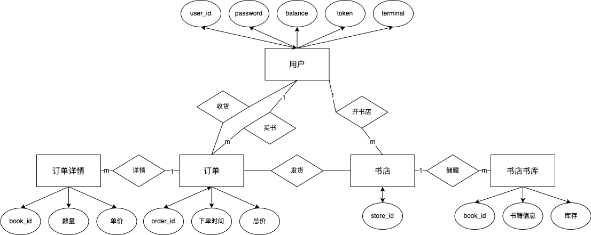

## 关系数据库设计

### 概念设计


### ER图



### 数据库表

```SQL
CREATE TABLE book (
id TEXT PRIMARY KEY, title TEXT, author TEXT, 
publisher TEXT, original_title TEXT, 
translator TEXT, pub_year TEXT, pages INTEGER, 
price INTEGER, currency_unit TEXT, binding TEXT, 
isbn TEXT, author_intro TEXT, book_intro text, 
content TEXT, tags TEXT, picture BLOB)

CREATE TABLE IF NOT EXISTS user (
user_id TEXT PRIMARY KEY, password TEXT NOT NULL, 
balance INTEGER NOT NULL, token TEXT, terminal TEXT);

CREATE TABLE IF NOT EXISTS user_store(
user_id TEXT, store_id, PRIMARY KEY(user_id, store_id));

CREATE TABLE IF NOT EXISTS store(
store_id TEXT, book_id TEXT, book_info TEXT, stock_level INTEGER,
PRIMARY KEY(store_id, book_id))

CREATE TABLE IF NOT EXISTS new_order(
order_id TEXT, user_id TEXT, store_id TEXT, order_time TIME, total_price INTEGER, paid BOOLEAN, cancelled BOOLEAN, delivered BOOLEAN
PRIMARY KEY(order_id, user_id))

CREATE TABLE IF NOT EXISTS new_order_detail(
order_id TEXT, book_id TEXT, count INTEGER, price INTEGER
PRIMARY KEY(order_id, book_id))
```

## 内部实现介绍

### 用户权限

#### 接口

见`doc/auth.md`.

#### 后端逻辑

`__init__`: 初始化数据库表

`check_token`: 检查`token`的时效性，是否小于`token_lifetime`.

`register`: 注册用户。

`check_password`: 检查密码是否正确。

`login`: 登录。

`logout`: 登出。

`unregister`: 注销。

`change_password`: 修改密码。

#### 数据库操作

`__init__`: 初始化数据库表

`register`: 在`user`表中插入新用户。

`check_password`: 在`user`表中查询`user_id`用户的密码。

`login`: 若密码验证成功， 在`user`表中更新`token`和`terminal`。

`logout`: 若为登录状态，在`user`表中更新`token`和`terminal`。

`unregister`: 在`user`表中删除`user_id`的用户。

`change_password`: 在`user`表中更新`user_id`用户的密码`password`。

#### 测试用例

`test_login.py`: 验证登录登出成功，和错误账号、密码的登出。

`test_password.py`: 验证修改密码后的登录，错误账号、密码。

`test_register.py`: 验证注册注销成功，错误账号密码，注册已注册账号。

### 买家用户

#### 接口
见`doc/buyer.md`

#### 后端逻辑
`__init__`: 初始化数据库表

`new_order`: 生成一个新的订单，包括其具体的信息（书籍以及数量）.

`payment`: 支付`order_id`订单。

`add_funds`: 增加存款。

`query_orders`: 查询订单。

`cancel_order`: 取消订单。

#### 数据库操作
`__init__`: 初始化数据库表

`new_order`: 在插入前检查该用户是否拥有足够的存款来支付这笔订单所需要的花费，若满足，则在`neworder`表中插入该订单简要信息，即`store_id`, `user_id`等，并在`neworderdetail`表中插入订单具体信息。

`payment`: 若用户足够支付这笔订单的花费，并且满足其他前置条件，则在`order`表中将`paid`属性改为`True`，并将用户的存款`balance`属性减去对应价格。

`add_funds`: 若`user`的`token`满足条件，则将`user`的`balance`属性增加对应数值。

`query_orders`: 在`neworder`表以及`neworderdetail`表中查询对应信息，并将其放入`orders`的`list`中返回。

`cancel_order`: 在`neworder`表以及`neworderdetail`表中查询对应信息，若可以取消该订单，根据`paid`的对应属性来判断是否需要退款，如果需要退款，则在`user`的数据库中将对应`buyer_id`的存款退回，并将`seller_id`的金额减去相应数值，最后将`order`表中对应属性`cancelled`设置为`True`。

#### 测试用例
`test_add_funds.py`: 验证用户存取款是否成功，以及错误账号密码是否返回错误。

`test_cancel_order.py`: 验证用户取消订单是否成功，以及重复取消，过期取消和过期取消后继续支付等问题。

`test_new_order.py`: 验证是否成功发起新订单，以及书籍和商店和用户信息是否存在，以及是否拥有足够的库存量等问题。

`test_payment.py`: 验证订单支付是否成功，以及存款不足、用户认证失败、重复付款、取消后付款等问题。

`test_query_orders.py`: 验证订单是否查询成功，以及用户认证失败等问题。
### 卖家用户

#### 接口

见`doc/seller.md`

#### 后端逻辑

`__init__`: 初始化数据库表。

`add_book`: 添加图书。

`add_stock_level`: 添加库存。

`create_store`: 创建店铺。

#### 数据库操作

`__init__`: 初始化数据库表。

`add_book`: 在`store`表中插入一条`(store_id, book_id)`的数据。

`add_stock_level`: 在`store`表中对`(store_id, book_id)`的库存`stock_level`增加。

`create_store`: 在`user_store`中插入一条`store_id`, `user_id`。

#### 测试用例

`test_add_book.py`: 验证添加图书成功，不存在的`store_id`，`store`中已存在`book_id`，不存在的`user_id`。

`test_add_stock_level.py`: 验证添加库存成功，不存在的`store_id`，`store`中不存在`book_id`，不存在的`user_id`。

`test_create_store.py`: 验证创建店铺成功，已存在的`store_id`。

### 发货收货 

#### 接口
`be/model/seller.py`：deliver_order函数。
具体可见`doc/seller.md`。

#### 后端逻辑
在收到一个`order_id`的对应`order`的发货请求后，首先是判断该`order`是不是存在，以及检查该`order`的前置条件是否均被满足（即是否已经付款，并且没有被取消等）。若该`order`满足发货要求，则在`orderDetail`中找出该`order`所购买的书籍以及数量，并判断书店中的库存是否满足要求，若满足要求，则进行发货，同时减少商店中对应书籍的库存量。最后将该`order`的`delivered`属性设置为`True`，表示该订单已经发货。

#### 数据库操作
在`neworder`数据库中查询对应`order_id`的所有信息，并在`neworderdetail`数据库中查询对应订单的具体信息，随后在store数据库中对对应`store_id`和`book_id`的对应数据将`stock_level`减去对应数值，最后在`order`数据库中将`delivered`属性设置为`True`。

#### 测试用例
`fe/test/test_deliver_order.py`: 一共进行了四种不同的测试：正常发货、未付款要求发货、重复发货、取消订单后要求发货，测试用例均正常通过。

### 搜索图书

#### 接口

见 [search.md](bookstore/doc/search.md)

#### 后端逻辑

后端接受两种图书信息访问模式，其一是直接使用 `book_id` 或者 `isbn` 进行访问，返回完整数据。或者使用搜索关键词 `term` 进行模糊查询。进行模糊查询时可以附加 `store_id` 限定店铺，否则在全站搜索。

#### 数据库操作

- 直接访问
  - 使用 `book_id` 或 `isbn` 作为唯一搜索限制进行搜索，返回完整数据

- 模糊搜索
  - 全站搜索：使用 `term` 在 `title`, `author`, `publisher`, `original_title`, `translator`, `tags`, `content` 任意部分进行字符串部分匹配，**不区分大小写**
  - 店铺搜索：先将 `book` 和 `store` 数据表以 `book_id` 进行连接，而后再指定店铺下同上搜索
  - 分页：使用 `skip` 和 `limit` 功能实现，一页结果数由用户决定，默认为 30
  - 返回结果：`id`, `title`, `author`, `publisher`, `original_title`, `translator`, `pub_year`, `price`, `binding`, `tags`, `picture`（参考主流网购网站在搜索结果页面需要显示的信息）

#### 测试用例

`test_book_info.py`：测试以两种方式直接访问指定图书

`test_fuzzy_search.py`：测试使用不同关键词（书名、标签、出版社等）进行模糊查询，匹配书籍的不同信息（简介等），并测试分页功能

### 订单状态、查询取消订单

#### 接口

见`doc/buyer.md`

#### 后端逻辑

`query_orders`: 查询`user_id`的所有订单，显示订单号，书店ID，下单时间，总金额，支付、取消状态，以及订单内书籍信息。

`cancel_order`: 取消`order_id`的订单，若已取消则会返回错误，若订单已支付则会退款。

设置了`paytimeLimit`的超时未付款取消订单时间，用lazy update的方式，在查询、取消、或支付订单时判断其是否超时，若超时则取消订单。

#### 数据库操作

`query_orders`: 在`new_order`表中查询`user_id`用户的所有订单的所有信息，并在`new_order_detail`表中，查询每个`order_id`购买书籍的详细信息。

`cancel_order`: 在`new_order`表中查询`order_id`的付款和取消状态。若已支付，则在`user`表中`buyer_id`和`seller_id`表项更新`balance`。若未支付，则在`new_order`表中更新`cancel`为`1`。

付款超时：在`new_order`表中查询该订单的付款时间。若超过`paytimeLimit`，则在`new_order`表中更新`cancel`为`1`。

#### 测试用例

`test_query_orders.py`: 验证查询订单成功，查询不存在的用户。

`test_cancel_order.py`: 验证取消订单成功，已支付的订单验证退款。验证重复取消，超时取消，验证超时后不可支付。

## 测试结果和覆盖率

| Name                             | Stmts    | Miss    | Cover   |
| -------------------------------- | -------- | ------- | ------- |
| bookstore/be/__init__.py         | 0        | 0       | 100%    |
| bookstore/be/model/__init__.py   | 0        | 0       | 100%    |
| bookstore/be/model/buyer.py      | 182      | 33      | 82%     |
| bookstore/be/model/collection.py | 8        | 1       | 88%     |
| bookstore/be/model/database.py   | 35       | 1       | 97%     |
| bookstore/be/model/error.py      | 27       | 2       | 93%     |
| bookstore/be/model/seller.py     | 52       | 13      | 75%     |
| bookstore/be/model/user.py       | 120      | 23      | 81%     |
| bookstore/be/serve.py            | 35       | 6       | 83%     |
| bookstore/be/view/__init__.py    | 0        | 0       | 100%    |
| bookstore/be/view/auth.py        | 42       | 0       | 100%    |
| bookstore/be/view/buyer.py       | 50       | 0       | 100%    |
| bookstore/be/view/seller.py      | 31       | 0       | 100%    |
| __init__.py                      | 0        | 0       | 100%    |
| access/__init__.py               | 0        | 0       | 100%    |
| access/auth.py                   | 32       | 0       | 100%    |
| access/book.py                   | 64       | 0       | 100%    |
| access/buyer.py                  | 49       | 0       | 100%    |
| access/new_buyer.py              | 8        | 0       | 100%    |
| access/new_seller.py             | 8        | 0       | 100%    |
| access/seller.py                 | 31       | 0       | 100%    |
| bench/__init__.py                | 0        | 0       | 100%    |
| bench/run.py                     | 13       | 0       | 100%    |
| bench/session.py                 | 47       | 18      | 62%     |
| bench/workload.py                | 125      | 23      | 82%     |
| conf.py                          | 11       | 0       | 100%    |
| conftest.py                      | 17       | 4       | 76%     |
| test/gen_book_data.py            | 48       | 1       | 98%     |
| test/test_add_book.py            | 36       | 0       | 100%    |
| test/test_add_funds.py           | 30       | 0       | 100%    |
| test/test_add_stock_level.py     | 39       | 0       | 100%    |
| test/test_bench.py               | 6        | 2       | 67%     |
| test/test_cancel_order.py        | 78       | 2       | 97%     |
| test/test_create_store.py        | 20       | 0       | 100%    |
| test/test_login.py               | 28       | 0       | 100%    |
| test/test_new_order.py           | 40       | 0       | 100%    |
| test/test_password.py            | 33       | 0       | 100%    |
| test/test_payment.py             | 78       | 1       | 99%     |
| test/test_query_orders.py        | 28       | 0       | 100%    |
| test/test_register.py            | 31       | 0       | 100%    |
| **TOTAL**                        | **1482** | **130** | **91%** |

## 亮点

1. 完全使用git管理整个仓库。
2. 搜索功能支持模糊搜索，并且仅返回搜索结果显示页面必须的内容减少开销。
3. 数据库使用了 ORM 实现，同时使用了索引和事务处理。对于 sql 操作分段 commit，若遇到问题则会 rollback。